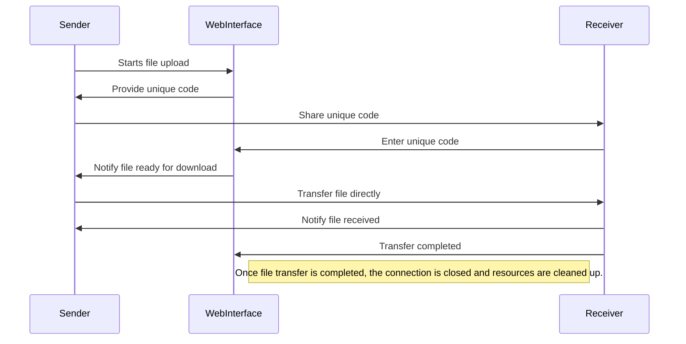

# SendIt: Secure Direct File Sharing

**SendIt** offers a secure, serverless method to directly share files between users, facilitated by WebSockets. This Python Flask-based application ensures files are transferred peer-to-peer without ever being stored on a server, preserving privacy and reducing dependency on cloud storage.

## Features
- **Direct Peer-to-Peer Transfers:** Utilizes WebSockets for real-time, direct file sharing without server storage.
- **Temporary Transfer Codes:** Generates temporary codes for file transfers, which expire after 10 minutes to secure each transaction.
- **Real-Time Notifications:** Updates senders and receivers about file status, including download progress and time until expiry.
- **Web Interface:** Simple, intuitive web-based interface for easy file transfers from any modern browser.

## Technologies
- **Backend:** Python Flask with Flask-SocketIO for handling WebSocket connections.
- **Frontend:** HTML5, CSS3, and Vanilla JavaScript for a dynamic user experience.

## Installation and Setup

1. **Clone the repository:**
    ```bash
    git clone https://github.com/yourusername/SendIt.git
    cd SendIt/SendIt
    ```

2. **Install dependencies:**
    ```bash
    pip install Flask Flask-SocketIO
    ```

3. **Run the application:**
    ```bash
    python app.py
    ```

## Usage
- **Uploading a File:** Drag and drop a file into the web interface or click to select a file. A unique code will be generated.
- **Downloading a File:** Enter the code received from the sender to begin the direct download.

## Workflow


# Contributing
Contributions to enhance functionality, improve design, or fix bugs are always welcome. Please fork the repository, make your changes, and submit a pull request.
